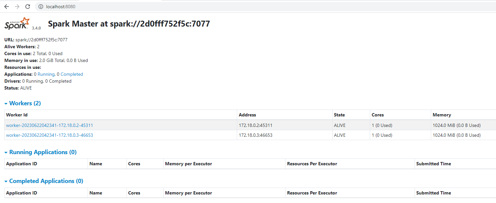
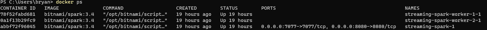
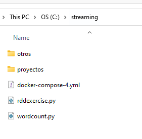
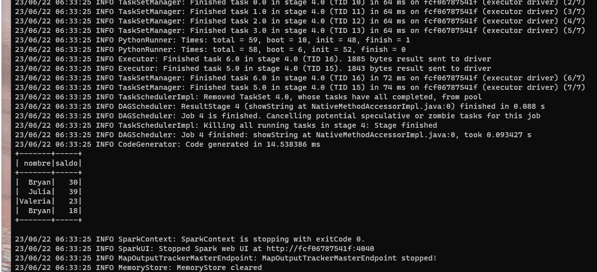
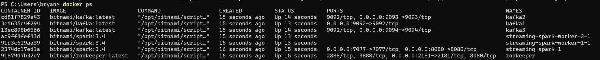
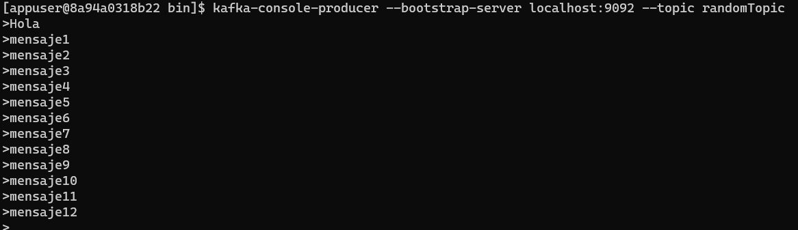
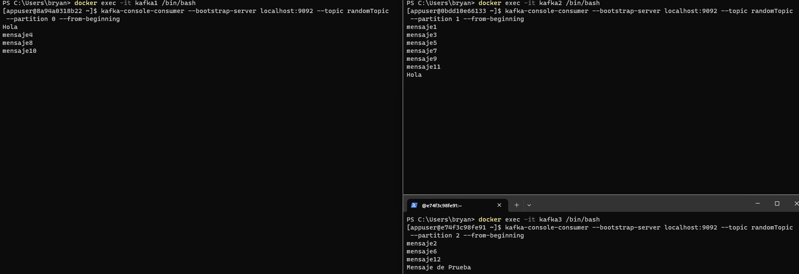

# Instalacion de Spark y Kafka
El objetivo de estar instalar es contar con una cluster multinodo, con las tecnologias Spark y Kafka.

## Pre-requisitos 💡

* [Instalar Docker](https://www.docker.com/products/docker-desktop/)
  * [Video Explicativo](https://www.youtube.com/watch?v=ZO4KWQfUBBc )
* [Instalar Git](https://git-scm.com/downloads)

## Spark
* Crear cluster con docker file

    A partir del archivo [docker-compose.yml](https://github.com/bvivanco/streaming-docker/blob/main/docker-compose.yml) vamos a crear nuestro cluster.

    Abrimos un cmd y nos ubicamos donde se encuentra el archivo .yml, ejecutando este comando:

    ```bash
    docker compose -f docker-compose.yml up -d
    ```
    Esperamos unos minutos hasta que termine de crearse los contenedores de nuestro cluster.

    Abrir el siguiente link para validar la instalacion:

    [localhost:8080](http://localhost:8080/)

    

* Consultamos los contenedores creados

    Ejecutar el sgte comando:
    ```bash
    docker ps
    ```
    Resultado:
    

    Nota: Seleccionar el contenedor relacionado al nodo master de Spark, el nombre que tenga `spark-master`

* Ingresar al contenedor de Spark Master
    ```bash
    docker exec -it abbf72f96045 bash
    ```

* Ejecutar un codigo python para validar nuestro cluster

    Consideracion: En la carpeta donde descargamos nuestro archivo `docker-compose.yml`, creamos un archivo .py con nuestro codigo.

    

    O en su defecto, descargamos el archivo [rddexercise.py](https://github.com/bvivanco/streaming-docker/blob/main/source/rddexercise.py)

    Nota: Este archivo podrá ser accedido dentro de nuestro cluster, en la ruta /opt/spark

    ```bash
    I have no name!@fcf06787541f:/opt/spark$ ls -1
    docker-compose-4.yml
    otros
    proyectos
    rddexercise.py
    wordcount.py
    ```
    Asegurarnos que estemos en esta ruta `/opt/bitnami/spark`, y ejecutar el siguiente comando:
    ```bash
    spark-submit /opt/spark/rddexercise.py
    ```
    Ejemplo de la ejecucion:

    ```bash
    I have no name!@fcf06787541f:/opt/bitnami/spark$ spark-submit /opt/spark/rddexercise.py
    ```
    Finalmente, como resultado nos deberia mostrar un dataframe:
    


# Instalacion de Kafka y Spark

* A partir del archivo [docker-compose.yml](https://github.com/bvivanco/streaming-docker/blob/main/docker-compose.yml) vamos a crear nuestro cluster Kafka y Spark.

    Abrimos un cmd y nos ubicamos donde se encuentra el archivo .yml, ejecutando este comando:

    ```bash
    docker compose -f docker-compose.yml up --build
    ```

    Validamos nuestros contenedores creados con el comando:

    ```bash
    docker ps
    ```
    

## Crear un topico
* Para crear un topico, entramos a cualquiera de nuestros contenedores con nombre kafka, es decir podemos elegir entre: kafka1, kafka2 y kafka3, y ejecutamos el comando:
    ```bash
    kafka-topics --bootstrap-server localhost:9092 --create --topic randomTopic --replication-factor 3 --partitions 3
    ```
## Listar un topico
* Para listar un topico, ejecutamos el comando:
    ```bash
    kafka-topics --bootstrap-server localhost:9092 --list
    ```
## Detalle de un topic
* Para ver el detalle de un topico, ejecutamos el comando:
    ```bash
    kafka-topics --bootstrap-server localhost:9092 --topic randomTopic --describe
    ```
## Produciendo mensajes
* Para producir/enviar mensaje lo hacemos a través de un producer, ejecutamos el comando:
    ```bash
    docker exec -it kafka1 /bin/bash

    kafka-console-producer --bootstrap-server localhost:9092 --topic randomTopic
    ```
    

## Consumiendo mensajes
* Para consumir/leer mensaje lo hacemos a través de un consumer, ejecutamos el comando:
    ```bash
    docker exec -it kafka1 /bin/bash

    kafka-console-consumer --bootstrap-server localhost:9092 --topic randomTopic --from-beginning
    ```
    

### Consumiendo mensajes por cada partition

* Para poder leer los mensajes según cada partition del topico, lo realizamos con `--partition numero`, es importante que entremos a cada instancia de nuestros brokers o contenedores con nombre kafka, veamos los comando:

```bash
 docker exec -it kafka1 /bin/bash

kafka-console-consumer --bootstrap-server 0.0.0.0:9092 --topic randomTopic -
-partition 0 --from-beginning
```

```bash
 docker exec -it kafka2 /bin/bash
 
kafka-console-consumer --bootstrap-server 0.0.0.0:9092 --topic randomTopic -
-partition 1 --from-beginning
```

```bash
 docker exec -it kafka3 /bin/bash
 
kafka-console-consumer --bootstrap-server 0.0.0.0:9092 --topic randomTopic -
-partition 2 --from-beginning
```

Finalmente deberíamos tener algo así, a medida que vayamos escribiendo los mensajes en nuestro producer, podemos ver a que partition llegan nuestros mensajes:

Nota: Podemos validar que los mensajes llegan particionados, y no se repiten entre los brokers.



## Ejecución de Kafka en Spark

* Ejecutar el comando de spark-submit con las depedencias de Kafka

    ```bash
    spark-submit --packages org.apache.spark:spark-sql-kafka-0-10_2.12:3.1.2 /opt/spark/kakfaSinkWithSpark.py
    ```
* Ejemplo de trama en nuestro producer (registrarlo un valor a la vez):
{"nombre":"Juan","apellido":"Gonzales","pais":"Peru"}
{"nombre":"Raul","apellido":"Gonzales","pais":"Colombia"}
{"nombre":"Jose","apellido":"Gonzales","pais":"Chile"}
{"nombre":"Pablo","apellido":"Gonzales","pais":"Ecuador"}
{"nombre":"Aldo","apellido":"Gonzales","pais":"Argentina"}