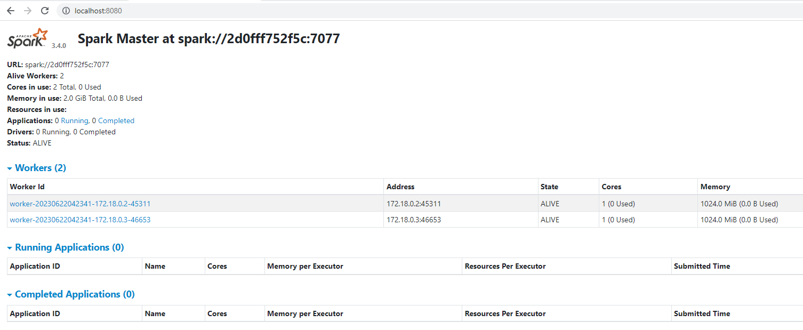

# Instalacion de Spark y Kafka
El objetivo de estar instalar es contar con una cluster multinodo, con las tecnologias Spark y Kafka.

## Spark
A partir del archivo "docker-compose.yml" vamos a crear nuestro cluster.

Usar el siguiente comando:

Abrimos un cmd y nos ubicamos donde se encuentra el archivo .yml

```bash
docker compose -f "myfile.yml" up -d
```
Esperamos unos minutos a que termine de crearse los contenedores de nuestro cluster.

Validamos abriendo el siguiente link:

[localhost:8080](http://localhost:8080/)

Nos deberia quedar algo asi:


