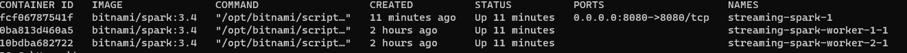

# Instalacion de Spark y Kafka
El objetivo de estar instalar es contar con una cluster multinodo, con las tecnologias Spark y Kafka.

## Spark
* Crear cluster con docker file

A partir del archivo "docker-compose.yml" vamos a crear nuestro cluster.

Abrimos un cmd y nos ubicamos donde se encuentra el archivo .yml, ejecutando este comando:

```bash
docker compose -f "myfile.yml" up -d
```
Esperamos unos minutos hasta que termine de crearse los contenedores de nuestro cluster.

Validamos abriendo el siguiente link:

[localhost:8080](http://localhost:8080/)

Nos deberia quedar algo asi:


* Consultamos los contenedores creados

    Ejecutar el sgte comando:
    ```bash
    docker ps
    ```
    Resultado:
    

    Nota: Seleccionar el contenedor relacionado al nodo master de Spark

* a
```bash
 docker exec -it fcf06787541f bash
```